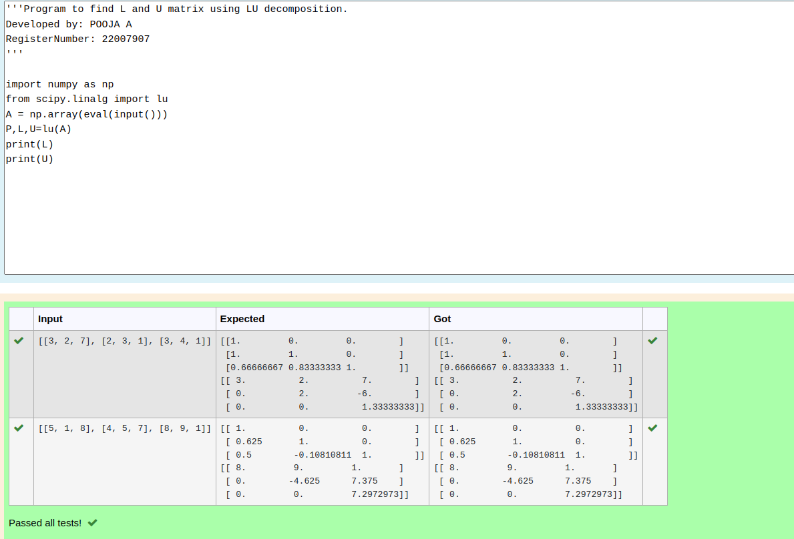

# LU Decomposition 

## AIM:
To write a program to find the LU Decomposition of a matrix.

## Equipments Required:
1. Hardware – PCs
2. Anaconda – Python 3.7 Installation / Moodle-Code Runner

## Algorithm
1. import numpy as np
2. import lu
3. take A = np.array(eval(input()))
4. take B = np.array(eval(input()))
5. print output
6. End the program

## Program:
(i) To find the L and U matrix
```
/*
Program to find the L and U matrix.
Developed by: POOJA A
RegisterNumber: 22007907

import numpy as np
from scipy.linalg import lu
A = np.array(eval(input()))
P,L,U=lu(A)
print(L)
print(U)
*/
```
(ii) To find the LU Decomposition of a matrix
```
/*
Program to find the LU Decomposition of a matrix.
Developed by: POOJA A
RegisterNumber: 22007907

# To print X matrix (solution to the equations)
import numpy as np
from scipy.linalg import lu_factor,lu_solve
A = np.array(eval(input()))
B = np.array(eval(input()))
lu,piv = lu_factor(A)
x=lu_solve((lu,piv),B)
print(x)
*/
```

## Output:



## Result:
Thus the program to find the LU Decomposition of a matrix is written and verified using python programming.

